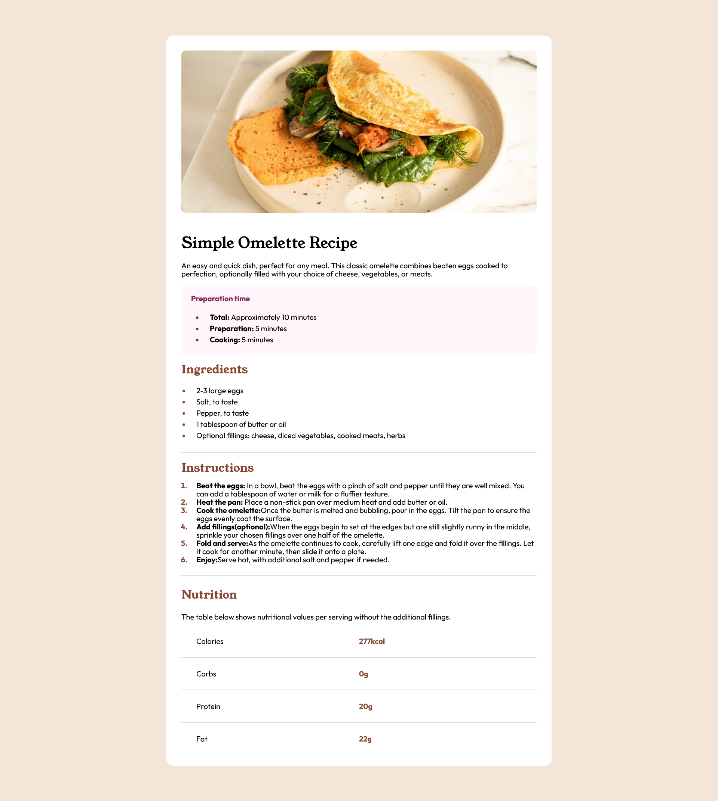

# Frontend Mentor - Recipe page solution

This is a solution to the [Recipe page challenge on Frontend Mentor](https://www.frontendmentor.io/challenges/recipe-page-KiTsR8QQKm). Frontend Mentor challenges help you improve your coding skills by building realistic projects. 

## Table of contents

- [Overview](#overview)
  - [The challenge](#the-challenge)
  - [Screenshot](#screenshot)
  - [Links](#links)
- [My process](#my-process)
  - [Built with](#built-with)
  - [What I learned](#what-i-learned)
  - [Continued development](#continued-development)
  - [Useful resources](#useful-resources)
- [Author](#author)


## Overview

### Screenshot




### Links

- Solution URL: [https://github.com/Alfonso-1701/Recipe_Page](https://github.com/Alfonso-1701/Recipe_Page)
- Live Site URL: [https://fascinating-kangaroo-112ec6.netlify.app](https://fascinating-kangaroo-112ec6.netlify.app)

## My process

After the set up of the HTML, spent some time on the set up for each of the different sections. Added small styling such as colors and fonts to the seperate areas. built the page section by section. After I finished the desktop design, I added my media query and reformat it for mobile. 

### Built with

- Semantic HTML5 markup
- CSS custom properties


### What I learned

The biggest hurdle I came across was during sizing for mobile. My width would continually create a horizontal scroll bar. I experimented with vw(viewport width), width, and eliminating the padding. I noticed that it only overflowed when padding was added. After some research, identified I needed to adjust my box-sizing to border box. This would account for the padding BEFORE it was sized to 100%, eliminating the overflow. 
```css
.main_shell{
  box-sizing: border-box;
}
```

Got caught up with the full width picture for mobile. Because I had done desktop first, I had it designed inside the main block, taking advantage of the overall padding. I ended up splitting the picture into its own element and stitching them together so I could have a padding value for desktop but eliminate it for mobile. 


### Continued development

-Want to start mobile first after some research, understanding why it is the preferred method of workflow.

-Was moderately comfortable with ul/ol, but would like another round of practice to be fluent in adding and manipulating them


### Useful resources

- [W3schools](https://www.w3schools.com) - Such a good resource to be able to refine understanding on simple concepts.
- [mdn web docs](https://developer.mozilla.org) - covers all the basics on css. Great reference


## Author

- Frontend Mentor - [@Alfonso-1701](https://www.frontendmentor.io/profile/Alfonso-1701)
-Linked In - [Alfonso Alvarez](https://www.linkedin.com)

